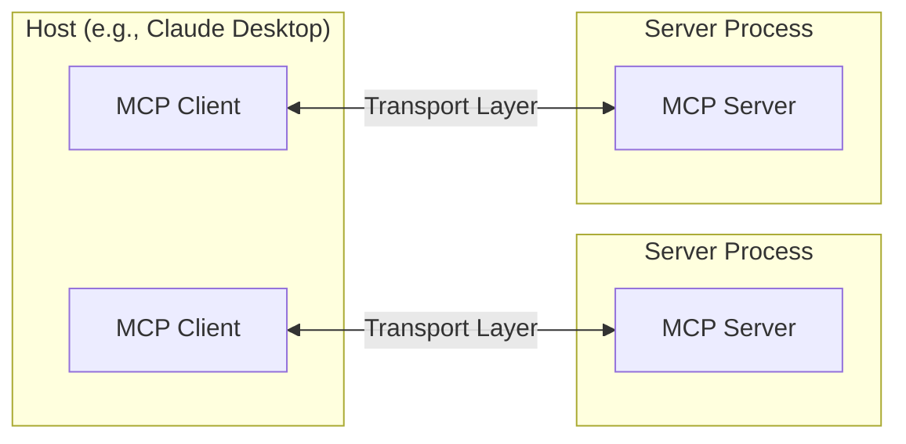
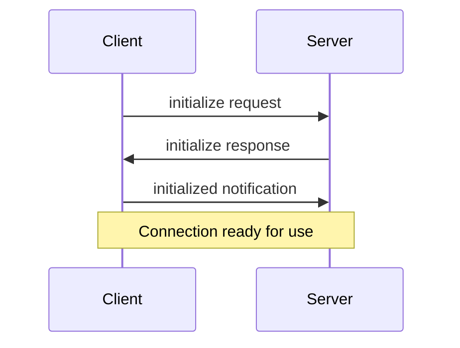

# Build an MCP Server using FastMCP

---
# Documentation
---

# Core architecture

Understand how MCP connects clients, servers, and LLMs

The Model Context Protocol (MCP) is built on a flexible, extensible architecture that enables seamless communication between LLM applications and integrations. This document covers the core architectural components and concepts.

## Overview

MCP follows a client-server architecture where:

*   **Hosts** are LLM applications (like Claude Desktop or IDEs) that initiate connections
*   **Clients** maintain 1:1 connections with servers, inside the host application
*   **Servers** provide context, tools, and prompts to clients



## Core components

### Protocol layer

The protocol layer handles message framing, request/response linking, and high-level communication patterns.

<Tabs>
  <Tab title="TypeScript">
    ```typescript
    class Protocol<Request, Notification, Result> {
        // Handle incoming requests
        setRequestHandler<T>(schema: T, handler: (request: T, extra: RequestHandlerExtra) => Promise<r>): void

        // Handle incoming notifications
        setNotificationHandler<T>(schema: T, handler: (notification: T) => Promise<void>): void

        // Send requests and await responses
        request<T>(request: Request, schema: T, options?: RequestOptions): Promise<T>

        // Send one-way notifications
        notification(notification: Notification): Promise<void>
    }
    ```
  </Tab>

  <Tab title="Python">
    ```python
    class Session(BaseSession[RequestT, NotificationT, ResultT]):
        async def send_request(
            self,
            request: RequestT,
            result_type: type[Result]
        ) -> Result:
            """
            Send request and wait for response. Raises McpError if response contains error.
            """
            # Request handling implementation

        async def send_notification(
            self,
            notification: NotificationT
        ) -> None:
            """Send one-way notification that doesn't expect response."""
            # Notification handling implementation

        async def _received_request(
            self,
            responder: RequestResponder[ReceiveRequestT, ResultT]
        ) -> None:
            """Handle incoming request from other side."""
            # Request handling implementation

        async def _received_notification(
            self,
            notification: ReceiveNotificationT
        ) -> None:
            """Handle incoming notification from other side."""
            # Notification handling implementation
    ```
  </Tab>
</Tabs>

Key classes include:

*   `Protocol`
*   `Client`
*   `Server`

### Transport layer

The transport layer handles the actual communication between clients and servers. MCP supports multiple transport mechanisms:

1.  **Stdio transport**
    *   Uses standard input/output for communication
    *   Ideal for local processes

2.  **HTTP with SSE transport**
    *   Uses Server-Sent Events for server-to-client messages
    *   HTTP POST for client-to-server messages

All transports use [JSON-RPC](https://www.jsonrpc.org/) 2.0 to exchange messages. See the [specification](https://spec.modelcontextprotocol.io) for detailed information about the Model Context Protocol message format.

### Message types

MCP has these main types of messages:

1.  **Requests** expect a response from the other side:
    ```typescript
    interface Request {
      method: string;
      params?: { ... };
    }
    ```

2.  **Results** are successful responses to requests:
    ```typescript
    interface Result {
      [key: string]: unknown;
    }
    ```

3.  **Errors** indicate that a request failed:
    ```typescript
    interface Error {
      code: number;
      message: string;
      data?: unknown;
    }
    ```

4.  **Notifications** are one-way messages that don't expect a response:
    ```typescript
    interface Notification {
      method: string;
      params?: { ... };
    }
    ```

## Connection lifecycle

### 1. Initialization



1.  Client sends `initialize` request with protocol version and capabilities
2.  Server responds with its protocol version and capabilities
3.  Client sends `initialized` notification as acknowledgment
4.  Normal message exchange begins

### 2. Message exchange

After initialization, the following patterns are supported:

*   **Request-Response**: Client or server sends requests, the other responds
*   **Notifications**: Either party sends one-way messages

### 3. Termination

Either party can terminate the connection:

*   Clean shutdown via `close()`
*   Transport disconnection
*   Error conditions

## Error handling

MCP defines these standard error codes:

```typescript
enum ErrorCode {
  // Standard JSON-RPC error codes
  ParseError = -32700,
  InvalidRequest = -32600,
  MethodNotFound = -32601,
  InvalidParams = -32602,
  InternalError = -32603
}
```

SDKs and applications can define their own error codes above -32000.

Errors are propagated through:

*   Error responses to requests
*   Error events on transports
*   Protocol-level error handlers

## Implementation example

Here's a basic example of implementing an MCP server:

<Tabs>
  <Tab title="TypeScript">
    ```typescript
    import { Server } from "@modelcontextprotocol/sdk/server/index.js";
    import { StdioServerTransport } from "@modelcontextprotocol/sdk/server/stdio.js";

    const server = new Server({
      name: "example-server",
      version: "1.0.0"
    }, {
      capabilities: {
        resources: {}
      }
    });

    // Handle requests
    server.setRequestHandler(ListResourcesRequestSchema, async () => {
      return {
        resources: [
          {
            uri: "example://resource",
            name: "Example Resource"
          }
        ]
      };
    });

    // Connect transport
    const transport = new StdioServerTransport();
    await server.connect(transport);
    ```
  </Tab>

  <Tab title="Python">
    ```python
    import asyncio
    import mcp.types as types
    from mcp.server import Server
    from mcp.server.stdio import stdio_server

    app = Server("example-server")

    @app.list_resources()
    async def list_resources() -> list[types.Resource]:
        return [
            types.Resource(
                uri="example://resource",
                name="Example Resource"
            )
        ]

    async def main():
        async with stdio_server() as streams:
            await app.run(
                streams[0],
                streams[1],
                app.create_initialization_options()
            )

    if __name__ == "__main__":
        asyncio.run(main)
    ```
  </Tab>
</Tabs>

## Best practices

### Transport selection

1.  **Local communication**
    *   Use stdio transport for local processes
    *   Efficient for same-machine communication
    *   Simple process management

2.  **Remote communication**
    *   Use SSE for scenarios requiring HTTP compatibility
    *   Consider security implications including authentication and authorization

### Message handling

1.  **Request processing**
    *   Validate inputs thoroughly
    *   Use type-safe schemas
    *   Handle errors gracefully
    *   Implement timeouts

2.  **Progress reporting**
    *   Use progress tokens for long operations
    *   Report progress incrementally
    *   Include total progress when known

3.  **Error management**
    *   Use appropriate error codes
    *   Include helpful error messages
    *   Clean up resources on errors

## Security considerations

1.  **Transport security**
    *   Use TLS for remote connections
    *   Validate connection origins
    *   Implement authentication when needed

2.  **Message validation**
    *   Validate all incoming messages
    *   Sanitize inputs
    *   Check message size limits
    *   Verify JSON-RPC format

3.  **Resource protection**
    *   Implement access controls
    *   Validate resource paths
    *   Monitor resource usage
    *   Rate limit requests

4.  **Error handling**
    *   Don't leak sensitive information
    *   Log security-relevant errors
    *   Implement proper cleanup
    *   Handle DoS scenarios

## Debugging and monitoring

1.  **Logging**
    *   Log protocol events
    *   Track message flow
    *   Monitor performance
    *   Record errors

2.  **Diagnostics**
    *   Implement health checks
    *   Monitor connection state
    *   Track resource usage
    *   Profile performance

3.  **Testing**
    *   Test different transports
    *   Verify error handling
    *   Check edge cases
    *   Load test servers


# Prompts

Create reusable prompt templates and workflows

Prompts enable servers to define reusable prompt templates and workflows that clients can easily surface to users and LLMs. They provide a powerful way to standardize and share common LLM interactions.

<Note>
  Prompts are designed to be **user-controlled**, meaning they are exposed from servers to clients with the intention of the user being able to explicitly select them for use.
</Note>

## Overview

Prompts in MCP are predefined templates that can:

*   Accept dynamic arguments
*   Include context from resources
*   Chain multiple interactions
*   Guide specific workflows
*   Surface as UI elements (like slash commands)

## Prompt structure

Each prompt is defined with:

```typescript
{
  name: string;              // Unique identifier for the prompt
  description?: string;      // Human-readable description
  arguments?: [              // Optional list of arguments
    {
      name: string;          // Argument identifier
      description?: string;  // Argument description
      required?: boolean;    // Whether argument is required
    }
  ]
}
```

## Discovering prompts

Clients can discover available prompts through the `prompts/list` endpoint:

```typescript
// Request
{
  method: "prompts/list"
}

// Response
{
  prompts: [
    {
      name: "analyze-code",
      description: "Analyze code for potential improvements",
      arguments: [
        {
          name: "language",
          description: "Programming language",
          required: true
        }
      ]
    }
  ]
}
```

## Using prompts

To use a prompt, clients make a `prompts/get` request:

````typescript
// Request
{
  method: "prompts/get",
  params: {
    name: "analyze-code",
    arguments: {
      language: "python"
    }
  }
}

// Response
{
  description: "Analyze Python code for potential improvements",
  messages: [
    {
      role: "user",
      content: {
        type: "text",
        text: "Please analyze the following Python code for potential improvements:\n\n```python\ndef calculate_sum(numbers):\n    total = 0\n    for num in numbers:\n        total = total + num\n    return total\n\nresult = calculate_sum([1, 2, 3, 4, 5])\nprint(result)\n```"
      }
    }
  ]
}
````

## Dynamic prompts

Prompts can be dynamic and include:

### Embedded resource context

```json
{
  "name": "analyze-project",
  "description": "Analyze project logs and code",
  "arguments": [
    {
      "name": "timeframe",
      "description": "Time period to analyze logs",
      "required": true
    },
    {
      "name": "fileUri",
      "description": "URI of code file to review",
      "required": true
    }
  ]
}
```

When handling the `prompts/get` request:

```json
{
  "messages": [
    {
      "role": "user",
      "content": {
        "type": "text",
        "text": "Analyze these system logs and the code file for any issues:"
      }
    },
    {
      "role": "user",
      "content": {
        "type": "resource",
        "resource": {
          "uri": "logs://recent?timeframe=1h",
          "text": "[2024-03-14 15:32:11] ERROR: Connection timeout in network.py:127\n[2024-03-14 15:32:15] WARN: Retrying connection (attempt 2/3)\n[2024-03-14 15:32:20] ERROR: Max retries exceeded",
          "mimeType": "text/plain"
        }
      }
    },
    {
      "role": "user",
      "content": {
        "type": "resource",
        "resource": {
          "uri": "file:///path/to/code.py",
          "text": "def connect_to_service(timeout=30):\n    retries = 3\n    for attempt in range(retries):\n        try:\n            return establish_connection(timeout)\n        except TimeoutError:\n            if attempt == retries - 1:\n                raise\n            time.sleep(5)\n\ndef establish_connection(timeout):\n    # Connection implementation\n    pass",
          "mimeType": "text/x-python"
        }
      }
    }
  ]
}
```

### Multi-step workflows

```typescript
const debugWorkflow = {
  name: "debug-error",
  async getMessages(error: string) {
    return [
      {
        role: "user",
        content: {
          type: "text",
          text: `Here's an error I'm seeing: ${error}`
        }
      },
      {
        role: "assistant",
        content: {
          type: "text",
          text: "I'll help analyze this error. What have you tried so far?"
        }
      },
      {
        role: "user",
        content: {
          type: "text",
          text: "I've tried restarting the service, but the error persists."
        }
      }
    ];
  }
};
```

## Example implementation

Here's a complete example of implementing prompts in an MCP server:

<Tabs>
  <Tab title="TypeScript">
    ```typescript
    import { Server } from "@modelcontextprotocol/sdk/server";
    import {
      ListPromptsRequestSchema,
      GetPromptRequestSchema
    } from "@modelcontextprotocol/sdk/types";

    const PROMPTS = {
      "git-commit": {
        name: "git-commit",
        description: "Generate a Git commit message",
        arguments: [
          {
            name: "changes",
            description: "Git diff or description of changes",
            required: true
          }
        ]
      },
      "explain-code": {
        name: "explain-code",
        description: "Explain how code works",
        arguments: [
          {
            name: "code",
            description: "Code to explain",
            required: true
          },
          {
            name: "language",
            description: "Programming language",
            required: false
          }
        ]
      }
    };

    const server = new Server({
      name: "example-prompts-server",
      version: "1.0.0"
    }, {
      capabilities: {
        prompts: {}
      }
    });

    // List available prompts
    server.setRequestHandler(ListPromptsRequestSchema, async () => {
      return {
        prompts: Object.values(PROMPTS)
      };
    });

    // Get specific prompt
    server.setRequestHandler(GetPromptRequestSchema, async (request) => {
      const prompt = PROMPTS[request.params.name];
      if (!prompt) {
        throw new Error(`Prompt not found: ${request.params.name}`);
      }

      if (request.params.name === "git-commit") {
        return {
          messages: [
            {
              role: "user",
              content: {
                type: "text",
                text: `Generate a concise but descriptive commit message for these changes:\n\n${request.params.arguments?.changes}`
              }
            }
          ]
        };
      }

      if (request.params.name === "explain-code") {
        const language = request.params.arguments?.language || "Unknown";
        return {
          messages: [
            {
              role: "user",
              content: {
                type: "text",
                text: `Explain how this ${language} code works:\n\n${request.params.arguments?.code}`
              }
            }
          ]
        };
      }

      throw new Error("Prompt implementation not found");
    });
    ```
  </Tab>

  <Tab title="Python">
    ```python
    from mcp.server import Server
    import mcp.types as types

    # Define available prompts
    PROMPTS = {
        "git-commit": types.Prompt(
            name="git-commit",
            description="Generate a Git commit message",
            arguments=[
                types.PromptArgument(
                    name="changes",
                    description="Git diff or description of changes",
                    required=True
                )
            ],
        ),
        "explain-code": types.Prompt(
            name="explain-code",
            description="Explain how code works",
            arguments=[
                types.PromptArgument(
                    name="code",
                    description="Code to explain",
                    required=True
                ),
                types.PromptArgument(
                    name="language",
                    description="Programming language",
                    required=False
                )
            ],
        )
    }

    # Initialize server
    app = Server("example-prompts-server")

    @app.list_prompts()
    async def list_prompts() -> list[types.Prompt]:
        return list(PROMPTS.values())

    @app.get_prompt()
    async def get_prompt(
        name: str, arguments: dict[str, str] | None = None
    ) -> types.GetPromptResult:
        if name not in PROMPTS:
            raise ValueError(f"Prompt not found: {name}")

        if name == "git-commit":
            changes = arguments.get("changes") if arguments else ""
            return types.GetPromptResult(
                messages=[
                    types.PromptMessage(
                        role="user",
                        content=types.TextContent(
                            type="text",
                            text=f"Generate a concise but descriptive commit message "
                            f"for these changes:\n\n{changes}"
                        )
                    )
                ]
            )

        if name == "explain-code":
            code = arguments.get("code") if arguments else ""
            language = arguments.get("language", "Unknown") if arguments else "Unknown"
            return types.GetPromptResult(
                messages=[
                    types.PromptMessage(
                        role="user",
                        content=types.TextContent(
                            type="text",
                            text=f"Explain how this {language} code works:\n\n{code}"
                        )
                    )
                ]
            )

        raise ValueError("Prompt implementation not found")
    ```
  </Tab>
</Tabs>

## Best practices

When implementing prompts:

1.  Use clear, descriptive prompt names
2.  Provide detailed descriptions for prompts and arguments
3.  Validate all required arguments
4.  Handle missing arguments gracefully
5.  Consider versioning for prompt templates
6.  Cache dynamic content when appropriate
7.  Implement error handling
8.  Document expected argument formats
9.  Consider prompt composability
10. Test prompts with various inputs

## UI integration

Prompts can be surfaced in client UIs as:

*   Slash commands
*   Quick actions
*   Context menu items
*   Command palette entries
*   Guided workflows
*   Interactive forms

## Updates and changes

Servers can notify clients about prompt changes:

1.  Server capability: `prompts.listChanged`
2.  Notification: `notifications/prompts/list_changed`
3.  Client re-fetches prompt list

## Security considerations

When implementing prompts:

*   Validate all arguments
*   Sanitize user input
*   Consider rate limiting
*   Implement access controls
*   Audit prompt usage
*   Handle sensitive data appropriately
*   Validate generated content
*   Implement timeouts
*   Consider prompt injection risks
*   Document security requirements


# Resources

Expose data and content from your servers to LLMs

Resources are a core primitive in the Model Context Protocol (MCP) that allow servers to expose data and content that can be read by clients and used as context for LLM interactions.

<Note>
  Resources are designed to be **application-controlled**, meaning that the client application can decide how and when they should be used.
  Different MCP clients may handle resources differently. For example:

  *   Claude Desktop currently requires users to explicitly select resources before they can be used
  *   Other clients might automatically select resources based on heuristics
  *   Some implementations may even allow the AI model itself to determine which resources to use

  Server authors should be prepared to handle any of these interaction patterns when implementing resource support. In order to expose data to models automatically, server authors should use a **model-controlled** primitive such as [Tools](./tools).
</Note>

## Overview

Resources represent any kind of data that an MCP server wants to make available to clients. This can include:

*   File contents
*   Database records
*   API responses
*   Live system data
*   Screenshots and images
*   Log files
*   And more

Each resource is identified by a unique URI and can contain either text or binary data.

## Resource URIs

Resources are identified using URIs that follow this format:

```
[protocol]://[host]/[path]
```

For example:

*   `file:///home/user/documents/report.pdf`
*   `postgres://database/customers/schema`
*   `screen://localhost/display1`

The protocol and path structure is defined by the MCP server implementation. Servers can define their own custom URI schemes.

## Resource types

Resources can contain two types of content:

### Text resources

Text resources contain UTF-8 encoded text data. These are suitable for:

*   Source code
*   Configuration files
*   Log files
*   JSON/XML data
*   Plain text

### Binary resources

Binary resources contain raw binary data encoded in base64. These are suitable for:

*   Images
*   PDFs
*   Audio files
*   Video files
*   Other non-text formats

## Resource discovery

Clients can discover available resources through two main methods:

### Direct resources

Servers expose a list of concrete resources via the `resources/list` endpoint. Each resource includes:

```typescript
{
  uri: string;           // Unique identifier for the resource
  name: string;          // Human-readable name
  description?: string;  // Optional description
  mimeType?: string;     // Optional MIME type
}
```

### Resource templates

For dynamic resources, servers can expose [URI templates](https://datatracker.ietf.org/doc/html/rfc6570) that clients can use to construct valid resource URIs:

```typescript
{
  uriTemplate: string;   // URI template following RFC 6570
  name: string;          // Human-readable name for this type
  description?: string;  // Optional description
  mimeType?: string;     // Optional MIME type for all matching resources
}
```

## Reading resources

To read a resource, clients make a `resources/read` request with the resource URI.

The server responds with a list of resource contents:

```typescript
{
  contents: [
    {
      uri: string;        // The URI of the resource
      mimeType?: string;  // Optional MIME type

      // One of:
      text?: string;      // For text resources
      blob?: string;      // For binary resources (base64 encoded)
    }
  ]
}
```

<Tip>
  Servers may return multiple resources in response to one `resources/read` request. This could be used, for example, to return a list of files inside a directory when the directory is read.
</Tip>

## Resource updates

MCP supports real-time updates for resources through two mechanisms:

### List changes

Servers can notify clients when their list of available resources changes via the `notifications/resources/list_changed` notification.

### Content changes

Clients can subscribe to updates for specific resources:

1.  Client sends `resources/subscribe` with resource URI
2.  Server sends `notifications/resources/updated` when the resource changes
3.  Client can fetch latest content with `resources/read`
4.  Client can unsubscribe with `resources/unsubscribe`

## Example implementation

Here's a simple example of implementing resource support in an MCP server:

<Tabs>
  <Tab title="TypeScript">
    ```typescript
    const server = new Server({
      name: "example-server",
      version: "1.0.0"
    }, {
      capabilities: {
        resources: {}
      }
    });

    // List available resources
    server.setRequestHandler(ListResourcesRequestSchema, async () => {
      return {
        resources: [
          {
            uri: "file:///logs/app.log",
            name: "Application Logs",
            mimeType: "text/plain"
          }
        ]
      };
    });

    // Read resource contents
    server.setRequestHandler(ReadResourceRequestSchema, async (request) => {
      const uri = request.params.uri;

      if (uri === "file:///logs/app.log") {
        const logContents = await readLogFile();
        return {
          contents: [
            {
              uri,
              mimeType: "text/plain",
              text: logContents
            }
          ]
        };
      }

      throw new Error("Resource not found");
    });
    ```
  </Tab>

  <Tab title="Python">
    ```python
    app = Server("example-server")

    @app.list_resources()
    async def list_resources() -> list[types.Resource]:
        return [
            types.Resource(
                uri="file:///logs/app.log",
                name="Application Logs",
                mimeType="text/plain"
            )
        ]

    @app.read_resource()
    async def read_resource(uri: AnyUrl) -> str:
        if str(uri) == "file:///logs/app.log":
            log_contents = await read_log_file()
            return log_contents

        raise ValueError("Resource not found")

    # Start server
    async with stdio_server() as streams:
        await app.run(
            streams[0],
            streams[1],
            app.create_initialization_options()
        )
    ```
  </Tab>
</Tabs>

## Best practices

When implementing resource support:

1.  Use clear, descriptive resource names and URIs
2.  Include helpful descriptions to guide LLM understanding
3.  Set appropriate MIME types when known
4.  Implement resource templates for dynamic content
5.  Use subscriptions for frequently changing resources
6.  Handle errors gracefully with clear error messages
7.  Consider pagination for large resource lists
8.  Cache resource contents when appropriate
9.  Validate URIs before processing
10. Document your custom URI schemes

## Security considerations

When exposing resources:

*   Validate all resource URIs
*   Implement appropriate access controls
*   Sanitize file paths to prevent directory traversal
*   Be cautious with binary data handling
*   Consider rate limiting for resource reads
*   Audit resource access
*   Encrypt sensitive data in transit
*   Validate MIME types
*   Implement timeouts for long-running reads
*   Handle resource cleanup appropriately


# Sampling

Let your servers request completions from LLMs

Sampling is a powerful MCP feature that allows servers to request LLM completions through the client, enabling sophisticated agentic behaviors while maintaining security and privacy.

<Info>
  This feature of MCP is not yet supported in the Claude Desktop client.
</Info>

## How sampling works

The sampling flow follows these steps:

1.  Server sends a `sampling/createMessage` request to the client
2.  Client reviews the request and can modify it
3.  Client samples from an LLM
4.  Client reviews the completion
5.  Client returns the result to the server

This human-in-the-loop design ensures users maintain control over what the LLM sees and generates.

## Message format

Sampling requests use a standardized message format:

```typescript
{
  messages: [
    {
      role: "user" | "assistant",
      content: {
        type: "text" | "image",

        // For text:
        text?: string,

        // For images:
        data?: string,             // base64 encoded
        mimeType?: string
      }
    }
  ],
  modelPreferences?: {
    hints?: [{
      name?: string                // Suggested model name/family
    }],
    costPriority?: number,         // 0-1, importance of minimizing cost
    speedPriority?: number,        // 0-1, importance of low latency
    intelligencePriority?: number  // 0-1, importance of capabilities
  },
  systemPrompt?: string,
  includeContext?: "none" | "thisServer" | "allServers",
  temperature?: number,
  maxTokens: number,
  stopSequences?: string[],
  metadata?: Record<string, unknown>
}
```

## Request parameters

### Messages

The `messages` array contains the conversation history to send to the LLM. Each message has:

*   `role`: Either "user" or "assistant"
*   `content`: The message content, which can be:
    *   Text content with a `text` field
    *   Image content with `data` (base64) and `mimeType` fields

### Model preferences

The `modelPreferences` object allows servers to specify their model selection preferences:

*   `hints`: Array of model name suggestions that clients can use to select an appropriate model:
    *   `name`: String that can match full or partial model names (e.g. "claude-3", "sonnet")
    *   Clients may map hints to equivalent models from different providers
    *   Multiple hints are evaluated in preference order

*   Priority values (0-1 normalized):
    *   `costPriority`: Importance of minimizing costs
    *   `speedPriority`: Importance of low latency response
    *   `intelligencePriority`: Importance of advanced model capabilities

Clients make the final model selection based on these preferences and their available models.

### System prompt

An optional `systemPrompt` field allows servers to request a specific system prompt. The client may modify or ignore this.

### Context inclusion

The `includeContext` parameter specifies what MCP context to include:

*   `"none"`: No additional context
*   `"thisServer"`: Include context from the requesting server
*   `"allServers"`: Include context from all connected MCP servers

The client controls what context is actually included.

### Sampling parameters

Fine-tune the LLM sampling with:

*   `temperature`: Controls randomness (0.0 to 1.0)
*   `maxTokens`: Maximum tokens to generate
*   `stopSequences`: Array of sequences that stop generation
*   `metadata`: Additional provider-specific parameters

## Response format

The client returns a completion result:

```typescript
{
  model: string,  // Name of the model used
  stopReason?: "endTurn" | "stopSequence" | "maxTokens" | string,
  role: "user" | "assistant",
  content: {
    type: "text" | "image",
    text?: string,
    data?: string,
    mimeType?: string
  }
}
```

## Example request

Here's an example of requesting sampling from a client:

```json
{
  "method": "sampling/createMessage",
  "params": {
    "messages": [
      {
        "role": "user",
        "content": {
          "type": "text",
          "text": "What files are in the current directory?"
        }
      }
    ],
    "systemPrompt": "You are a helpful file system assistant.",
    "includeContext": "thisServer",
    "maxTokens": 100
  }
}
```

## Best practices

When implementing sampling:

1.  Always provide clear, well-structured prompts
2.  Handle both text and image content appropriately
3.  Set reasonable token limits
4.  Include relevant context through `includeContext`
5.  Validate responses before using them
6.  Handle errors gracefully
7.  Consider rate limiting sampling requests
8.  Document expected sampling behavior
9.  Test with various model parameters
10. Monitor sampling costs

## Human in the loop controls

Sampling is designed with human oversight in mind:

### For prompts

*   Clients should show users the proposed prompt
*   Users should be able to modify or reject prompts
*   System prompts can be filtered or modified
*   Context inclusion is controlled by the client

### For completions

*   Clients should show users the completion
*   Users should be able to modify or reject completions
*   Clients can filter or modify completions
*   Users control which model is used

## Security considerations

When implementing sampling:

*   Validate all message content
*   Sanitize sensitive information
*   Implement appropriate rate limits
*   Monitor sampling usage
*   Encrypt data in transit
*   Handle user data privacy
*   Audit sampling requests
*   Control cost exposure
*   Implement timeouts
*   Handle model errors gracefully

## Common patterns

### Agentic workflows

Sampling enables agentic patterns like:

*   Reading and analyzing resources
*   Making decisions based on context
*   Generating structured data
*   Handling multi-step tasks
*   Providing interactive assistance

### Context management

Best practices for context:

*   Request minimal necessary context
*   Structure context clearly
*   Handle context size limits
*   Update context as needed
*   Clean up stale context

### Error handling

Robust error handling should:

*   Catch sampling failures
*   Handle timeout errors
*   Manage rate limits
*   Validate responses
*   Provide fallback behaviors
*   Log errors appropriately

## Limitations

Be aware of these limitations:

*   Sampling depends on client capabilities
*   Users control sampling behavior
*   Context size has limits
*   Rate limits may apply
*   Costs should be considered
*   Model availability varies
*   Response times vary
*   Not all content types supported


# Tools

Enable LLMs to perform actions through your server

Tools are a powerful primitive in the Model Context Protocol (MCP) that enable servers to expose executable functionality to clients. Through tools, LLMs can interact with external systems, perform computations, and take actions in the real world.

<Note>
  Tools are designed to be **model-controlled**, meaning that tools are exposed from servers to clients with the intention of the AI model being able to automatically invoke them (with a human in the loop to grant approval).
</Note>

## Overview

Tools in MCP allow servers to expose executable functions that can be invoked by clients and used by LLMs to perform actions. Key aspects of tools include:

*   **Discovery**: Clients can list available tools through the `tools/list` endpoint
*   **Invocation**: Tools are called using the `tools/call` endpoint, where servers perform the requested operation and return results
*   **Flexibility**: Tools can range from simple calculations to complex API interactions

Like [resources](/docs/concepts/resources), tools are identified by unique names and can include descriptions to guide their usage. However, unlike resources, tools represent dynamic operations that can modify state or interact with external systems.

## Tool definition structure

Each tool is defined with the following structure:

```typescript
{
  name: string;          // Unique identifier for the tool
  description?: string;  // Human-readable description
  inputSchema: {         // JSON Schema for the tool's parameters
    type: "object",
    properties: { ... }  // Tool-specific parameters
  }
}
```

## Implementing tools

Here's an example of implementing a basic tool in an MCP server:

<Tabs>
  <Tab title="TypeScript">
    ```typescript
    const server = new Server({
      name: "example-server",
      version: "1.0.0"
    }, {
      capabilities: {
        tools: {}
      }
    });

    // Define available tools
    server.setRequestHandler(ListToolsRequestSchema, async () => {
      return {
        tools: [{
          name: "calculate_sum",
          description: "Add two numbers together",
          inputSchema: {
            type: "object",
            properties: {
              a: { type: "number" },
              b: { type: "number" }
            },
            required: ["a", "b"]
          }
        }]
      };
    });

    // Handle tool execution
    server.setRequestHandler(CallToolRequestSchema, async (request) => {
      if (request.params.name === "calculate_sum") {
        const { a, b } = request.params.arguments;
        return {
          toolResult: a + b
        };
      }
      throw new Error("Tool not found");
    });
    ```
  </Tab>

  <Tab title="Python">
    ```python
    app = Server("example-server")

    @app.list_tools()
    async def list_tools() -> list[types.Tool]:
        return [
            types.Tool(
                name="calculate_sum",
                description="Add two numbers together",
                inputSchema={
                    "type": "object",
                    "properties": {
                        "a": {"type": "number"},
                        "b": {"type": "number"}
                    },
                    "required": ["a", "b"]
                }
            )
        ]

    @app.call_tool()
    async def call_tool(
        name: str,
        arguments: dict
    ) -> list[types.TextContent | types.ImageContent | types.EmbeddedResource]:
        if name == "calculate_sum":
            a = arguments["a"]
            b = arguments["b"]
            result = a + b
            return [types.TextContent(type="text", text=str(result))]
        raise ValueError(f"Tool not found: {name}")
    ```
  </Tab>
</Tabs>

## Example tool patterns

Here are some examples of types of tools that a server could provide:

### System operations

Tools that interact with the local system:

```typescript
{
  name: "execute_command",
  description: "Run a shell command",
  inputSchema: {
    type: "object",
    properties: {
      command: { type: "string" },
      args: { type: "array", items: { type: "string" } }
    }
  }
}
```

### API integrations

Tools that wrap external APIs:

```typescript
{
  name: "github_create_issue",
  description: "Create a GitHub issue",
  inputSchema: {
    type: "object",
    properties: {
      title: { type: "string" },
      body: { type: "string" },
      labels: { type: "array", items: { type: "string" } }
    }
  }
}
```

### Data processing

Tools that transform or analyze data:

```typescript
{
  name: "analyze_csv",
  description: "Analyze a CSV file",
  inputSchema: {
    type: "object",
    properties: {
      filepath: { type: "string" },
      operations: {
        type: "array",
        items: {
          enum: ["sum", "average", "count"]
        }
      }
    }
  }
}
```

## Best practices

When implementing tools:

1.  Provide clear, descriptive names and descriptions
2.  Use detailed JSON Schema definitions for parameters
3.  Include examples in tool descriptions to demonstrate how the model should use them
4.  Implement proper error handling and validation
5.  Use progress reporting for long operations
6.  Keep tool operations focused and atomic
7.  Document expected return value structures
8.  Implement proper timeouts
9.  Consider rate limiting for resource-intensive operations
10. Log tool usage for debugging and monitoring

## Security considerations

When exposing tools:

### Input validation

*   Validate all parameters against the schema
*   Sanitize file paths and system commands
*   Validate URLs and external identifiers
*   Check parameter sizes and ranges
*   Prevent command injection

### Access control

*   Implement authentication where needed
*   Use appropriate authorization checks
*   Audit tool usage
*   Rate limit requests
*   Monitor for abuse

### Error handling

*   Don't expose internal errors to clients
*   Log security-relevant errors
*   Handle timeouts appropriately
*   Clean up resources after errors
*   Validate return values

## Tool discovery and updates

MCP supports dynamic tool discovery:

1.  Clients can list available tools at any time
2.  Servers can notify clients when tools change using `notifications/tools/list_changed`
3.  Tools can be added or removed during runtime
4.  Tool definitions can be updated (though this should be done carefully)

## Error handling

Tool errors should be reported within the result object, not as MCP protocol-level errors. This allows the LLM to see and potentially handle the error. When a tool encounters an error:

1.  Set `isError` to `true` in the result
2.  Include error details in the `content` array

Here's an example of proper error handling for tools:

<Tabs>
  <Tab title="TypeScript">
    ```typescript
    try {
      // Tool operation
      const result = performOperation();
      return {
        content: [
          {
            type: "text",
            text: `Operation successful: ${result}`
          }
        ]
      };
    } catch (error) {
      return {
        isError: true,
        content: [
          {
            type: "text",
            text: `Error: ${error.message}`
          }
        ]
      };
    }
    ```
  </Tab>

  <Tab title="Python">
    ```python
    try:
        # Tool operation
        result = perform_operation()
        return types.CallToolResult(
            content=[
                types.TextContent(
                    type="text",
                    text=f"Operation successful: {result}"
                )
            ]
        )
    except Exception as error:
        return types.CallToolResult(
            isError=True,
            content=[
                types.TextContent(
                    type="text",
                    text=f"Error: {str(error)}"
                )
            ]
        )
    ```
  </Tab>
</Tabs>

This approach allows the LLM to see that an error occurred and potentially take corrective action or request human intervention.

## Testing tools

A comprehensive testing strategy for MCP tools should cover:

*   **Functional testing**: Verify tools execute correctly with valid inputs and handle invalid inputs appropriately
*   **Integration testing**: Test tool interaction with external systems using both real and mocked dependencies
*   **Security testing**: Validate authentication, authorization, input sanitization, and rate limiting
*   **Performance testing**: Check behavior under load, timeout handling, and resource cleanup
*   **Error handling**: Ensure tools properly report errors through the MCP protocol and clean up resources


# Transports

Learn about MCP's communication mechanisms

Transports in the Model Context Protocol (MCP) provide the foundation for communication between clients and servers. A transport handles the underlying mechanics of how messages are sent and received.

## Message Format

MCP uses [JSON-RPC](https://www.jsonrpc.org/) 2.0 as its wire format. The transport layer is responsible for converting MCP protocol messages into JSON-RPC format for transmission and converting received JSON-RPC messages back into MCP protocol messages.

There are three types of JSON-RPC messages used:

### Requests

```typescript
{
  jsonrpc: "2.0",
  id: number | string,
  method: string,
  params?: object
}
```

### Responses

```typescript
{
  jsonrpc: "2.0",
  id: number | string,
  result?: object,
  error?: {
    code: number,
    message: string,
    data?: unknown
  }
}
```

### Notifications

```typescript
{
  jsonrpc: "2.0",
  method: string,
  params?: object
}
```

## Built-in Transport Types

MCP includes two standard transport implementations:

### Standard Input/Output (stdio)

The stdio transport enables communication through standard input and output streams. This is particularly useful for local integrations and command-line tools.

Use stdio when:

*   Building command-line tools
*   Implementing local integrations
*   Needing simple process communication
*   Working with shell scripts

<Tabs>
  <Tab title="TypeScript (Server)">
    ```typescript
    const server = new Server({
      name: "example-server",
      version: "1.0.0"
    }, {
      capabilities: {}
    });

    const transport = new StdioServerTransport();
    await server.connect(transport);
    ```
  </Tab>

  <Tab title="TypeScript (Client)">
    ```typescript
    const client = new Client({
      name: "example-client",
      version: "1.0.0"
    }, {
      capabilities: {}
    });

    const transport = new StdioClientTransport({
      command: "./server",
      args: ["--option", "value"]
    });
    await client.connect(transport);
    ```
  </Tab>

  <Tab title="Python (Server)">
    ```python
    app = Server("example-server")

    async with stdio_server() as streams:
        await app.run(
            streams[0],
            streams[1],
            app.create_initialization_options()
        )
    ```
  </Tab>

  <Tab title="Python (Client)">
    ```python
    params = StdioServerParameters(
        command="./server",
        args=["--option", "value"]
    )

    async with stdio_client(params) as streams:
        async with ClientSession(streams[0], streams[1]) as session:
            await session.initialize()
    ```
  </Tab>
</Tabs>

### Server-Sent Events (SSE)

SSE transport enables server-to-client streaming with HTTP POST requests for client-to-server communication.

Use SSE when:

*   Only server-to-client streaming is needed
*   Working with restricted networks
*   Implementing simple updates

<Tabs>
  <Tab title="TypeScript (Server)">
    ```typescript
    const server = new Server({
      name: "example-server",
      version: "1.0.0"
    }, {
      capabilities: {}
    });

    const transport = new SSEServerTransport("/message", response);
    await server.connect(transport);
    ```
  </Tab>

  <Tab title="TypeScript (Client)">
    ```typescript
    const client = new Client({
      name: "example-client",
      version: "1.0.0"
    }, {
      capabilities: {}
    });

    const transport = new SSEClientTransport(
      new URL("http://localhost:3000/sse")
    );
    await client.connect(transport);
    ```
  </Tab>

  <Tab title="Python (Server)">
    ```python
    from mcp.server.sse import SseServerTransport
    from starlette.applications import Starlette
    from starlette.routing import Route

    app = Server("example-server")
    sse = SseServerTransport("/messages")

    async def handle_sse(scope, receive, send):
        async with sse.connect_sse(scope, receive, send) as streams:
            await app.run(streams[0], streams[1], app.create_initialization_options())

    async def handle_messages(scope, receive, send):
        await sse.handle_post_message(scope, receive, send)

    starlette_app = Starlette(
        routes=[
            Route("/sse", endpoint=handle_sse),
            Route("/messages", endpoint=handle_messages, methods=["POST"]),
        ]
    )
    ```
  </Tab>

  <Tab title="Python (Client)">
    ```python
    async with sse_client("http://localhost:8000/sse") as streams:
        async with ClientSession(streams[0], streams[1]) as session:
            await session.initialize()
    ```
  </Tab>
</Tabs>

## Custom Transports

MCP makes it easy to implement custom transports for specific needs. Any transport implementation just needs to conform to the Transport interface:

You can implement custom transports for:

*   Custom network protocols
*   Specialized communication channels
*   Integration with existing systems
*   Performance optimization

<Tabs>
  <Tab title="TypeScript">
    ```typescript
    interface Transport {
      // Start processing messages
      start(): Promise<void>;

      // Send a JSON-RPC message
      send(message: JSONRPCMessage): Promise<void>;

      // Close the connection
      close(): Promise<void>;

      // Callbacks
      onclose?: () => void;
      onerror?: (error: Error) => void;
      onmessage?: (message: JSONRPCMessage) => void;
    }
    ```
  </Tab>

  <Tab title="Python">
    Note that while MCP Servers are often implemented with asyncio, we recommend
    implementing low-level interfaces like transports with `anyio` for wider compatibility.

    ```python
    @contextmanager
    async def create_transport(
        read_stream: MemoryObjectReceiveStream[JSONRPCMessage | Exception],
        write_stream: MemoryObjectSendStream[JSONRPCMessage]
    ):
        """
        Transport interface for MCP.

        Args:
            read_stream: Stream to read incoming messages from
            write_stream: Stream to write outgoing messages to
        """
        async with anyio.create_task_group() as tg:
            try:
                # Start processing messages
                tg.start_soon(lambda: process_messages(read_stream))

                # Send messages
                async with write_stream:
                    yield write_stream

            except Exception as exc:
                # Handle errors
                raise exc
            finally:
                # Clean up
                tg.cancel_scope.cancel()
                await write_stream.aclose()
                await read_stream.aclose()
    ```
  </Tab>
</Tabs>

## Error Handling

Transport implementations should handle various error scenarios:

1.  Connection errors
2.  Message parsing errors
3.  Protocol errors
4.  Network timeouts
5.  Resource cleanup

Example error handling:

<Tabs>
  <Tab title="TypeScript">
    ```typescript
    class ExampleTransport implements Transport {
      async start() {
        try {
          // Connection logic
        } catch (error) {
          this.onerror?.(new Error(`Failed to connect: ${error}`));
          throw error;
        }
      }

      async send(message: JSONRPCMessage) {
        try {
          // Sending logic
        } catch (error) {
          this.onerror?.(new Error(`Failed to send message: ${error}`));
          throw error;
        }
      }
    }
    ```
  </Tab>

  <Tab title="Python">
    Note that while MCP Servers are often implemented with asyncio, we recommend
    implementing low-level interfaces like transports with `anyio` for wider compatibility.

    ```python
    @contextmanager
    async def example_transport(scope: Scope, receive: Receive, send: Send):
        try:
            # Create streams for bidirectional communication
            read_stream_writer, read_stream = anyio.create_memory_object_stream(0)
            write_stream, write_stream_reader = anyio.create_memory_object_stream(0)

            async def message_handler():
                try:
                    async with read_stream_writer:
                        # Message handling logic
                        pass
                except Exception as exc:
                    logger.error(f"Failed to handle message: {exc}")
                    raise exc

            async with anyio.create_task_group() as tg:
                tg.start_soon(message_handler)
                try:
                    # Yield streams for communication
                    yield read_stream, write_stream
                except Exception as exc:
                    logger.error(f"Transport error: {exc}")
                    raise exc
                finally:
                    tg.cancel_scope.cancel()
                    await write_stream.aclose()
                    await read_stream.aclose()
        except Exception as exc:
            logger.error(f"Failed to initialize transport: {exc}")
            raise exc
    ```
  </Tab>
</Tabs>

## Best Practices

When implementing or using MCP transport:

1.  Handle connection lifecycle properly
2.  Implement proper error handling
3.  Clean up resources on connection close
4.  Use appropriate timeouts
5.  Validate messages before sending
6.  Log transport events for debugging
7.  Implement reconnection logic when appropriate
8.  Handle backpressure in message queues
9.  Monitor connection health
10. Implement proper security measures

## Security Considerations

When implementing transport:

### Authentication and Authorization

*   Implement proper authentication mechanisms
*   Validate client credentials
*   Use secure token handling
*   Implement authorization checks

### Data Security

*   Use TLS for network transport
*   Encrypt sensitive data
*   Validate message integrity
*   Implement message size limits
*   Sanitize input data

### Network Security

*   Implement rate limiting
*   Use appropriate timeouts
*   Handle denial of service scenarios
*   Monitor for unusual patterns
*   Implement proper firewall rules

## Debugging Transport

Tips for debugging transport issues:

1.  Enable debug logging
2.  Monitor message flow
3.  Check connection states
4.  Validate message formats
5.  Test error scenarios
6.  Use network analysis tools
7.  Implement health checks
8.  Monitor resource usage
9.  Test edge cases
10. Use proper error tracking

---
# Python FastMCP Documentation and Examples
---

# FastMCP README.md

# MCP Python SDK

<div align="center">

<strong>Python implementation of the Model Context Protocol (MCP)</strong>

[![PyPI][pypi-badge]][pypi-url]
[![MIT licensed][mit-badge]][mit-url]
[![Python Version][python-badge]][python-url]
[![Documentation][docs-badge]][docs-url]
[![Specification][spec-badge]][spec-url]
[![GitHub Discussions][discussions-badge]][discussions-url]

</div>

<!-- omit in toc -->
## Table of Contents

- [Overview](#overview)
- [Installation](#installation)
- [Quickstart](#quickstart)
- [What is MCP?](#what-is-mcp)
- [Core Concepts](#core-concepts)
  - [Server](#server)
  - [Resources](#resources)
  - [Tools](#tools)
  - [Prompts](#prompts)
  - [Images](#images)
  - [Context](#context)
- [Running Your Server](#running-your-server)
  - [Development Mode](#development-mode)
  - [Claude Desktop Integration](#claude-desktop-integration)
  - [Direct Execution](#direct-execution)
  - [Mounting to an Existing ASGI Server](#mounting-to-an-existing-asgi-server)
- [Examples](#examples)
  - [Echo Server](#echo-server)
  - [SQLite Explorer](#sqlite-explorer)
- [Advanced Usage](#advanced-usage)
  - [Low-Level Server](#low-level-server)
  - [Writing MCP Clients](#writing-mcp-clients)
  - [MCP Primitives](#mcp-primitives)
  - [Server Capabilities](#server-capabilities)
- [Documentation](#documentation)
- [Contributing](#contributing)
- [License](#license)

[pypi-badge]: https://img.shields.io/pypi/v/mcp.svg
[pypi-url]: https://pypi.org/project/mcp/
[mit-badge]: https://img.shields.io/pypi/l/mcp.svg
[mit-url]: https://github.com/modelcontextprotocol/python-sdk/blob/main/LICENSE
[python-badge]: https://img.shields.io/pypi/pyversions/mcp.svg
[python-url]: https://www.python.org/downloads/
[docs-badge]: https://img.shields.io/badge/docs-modelcontextprotocol.io-blue.svg
[docs-url]: https://modelcontextprotocol.io
[spec-badge]: https://img.shields.io/badge/spec-spec.modelcontextprotocol.io-blue.svg
[spec-url]: https://spec.modelcontextprotocol.io
[discussions-badge]: https://img.shields.io/github/discussions/modelcontextprotocol/python-sdk
[discussions-url]: https://github.com/modelcontextprotocol/python-sdk/discussions

## Overview

The Model Context Protocol allows applications to provide context for LLMs in a standardized way, separating the concerns of providing context from the actual LLM interaction. This Python SDK implements the full MCP specification, making it easy to:

- Build MCP clients that can connect to any MCP server
- Create MCP servers that expose resources, prompts and tools
- Use standard transports like stdio and SSE
- Handle all MCP protocol messages and lifecycle events

## Installation

### Adding MCP to your python project

We recommend using [uv](https://docs.astral.sh/uv/) to manage your Python projects. In a uv managed python project, add mcp to dependencies by:

```bash
uv add "mcp[cli]"
```

Alternatively, for projects using pip for dependencies:
```bash
pip install mcp
```

### Running the standalone MCP development tools

To run the mcp command with uv:

```bash
uv run mcp
```

## Quickstart

Let's create a simple MCP server that exposes a calculator tool and some data:

```python
# server.py
from mcp.server.fastmcp import FastMCP

# Create an MCP server
mcp = FastMCP("Demo")


# Add an addition tool
@mcp.tool()
def add(a: int, b: int) -> int:
    """Add two numbers"""
    return a + b


# Add a dynamic greeting resource
@mcp.resource("greeting://{name}")
def get_greeting(name: str) -> str:
    """Get a personalized greeting"""
    return f"Hello, {name}!"
```

You can install this server in [Claude Desktop](https://claude.ai/download) and interact with it right away by running:
```bash
mcp install server.py
```

Alternatively, you can test it with the MCP Inspector:
```bash
mcp dev server.py
```

## What is MCP?

The [Model Context Protocol (MCP)](https://modelcontextprotocol.io) lets you build servers that expose data and functionality to LLM applications in a secure, standardized way. Think of it like a web API, but specifically designed for LLM interactions. MCP servers can:

- Expose data through **Resources** (think of these sort of like GET endpoints; they are used to load information into the LLM's context)
- Provide functionality through **Tools** (sort of like POST endpoints; they are used to execute code or otherwise produce a side effect)
- Define interaction patterns through **Prompts** (reusable templates for LLM interactions)
- And more!

## Core Concepts

### Server

The FastMCP server is your core interface to the MCP protocol. It handles connection management, protocol compliance, and message routing:

```python
# Add lifespan support for startup/shutdown with strong typing
from contextlib import asynccontextmanager
from dataclasses import dataclass
from typing import AsyncIterator

from fake_database import Database  # Replace with your actual DB type

from mcp.server.fastmcp import Context, FastMCP

# Create a named server
mcp = FastMCP("My App")

# Specify dependencies for deployment and development
mcp = FastMCP("My App", dependencies=["pandas", "numpy"])


@dataclass
class AppContext:
    db: Database


@asynccontextmanager
async def app_lifespan(server: FastMCP) -> AsyncIterator[AppContext]:
    """Manage application lifecycle with type-safe context"""
    # Initialize on startup
    db = await Database.connect()
    try:
        yield AppContext(db=db)
    finally:
        # Cleanup on shutdown
        await db.disconnect()


# Pass lifespan to server
mcp = FastMCP("My App", lifespan=app_lifespan)


# Access type-safe lifespan context in tools
@mcp.tool()
def query_db(ctx: Context) -> str:
    """Tool that uses initialized resources"""
    db = ctx.request_context.lifespan_context["db"]
    return db.query()
```

### Resources

Resources are how you expose data to LLMs. They're similar to GET endpoints in a REST API - they provide data but shouldn't perform significant computation or have side effects:

```python
from mcp.server.fastmcp import FastMCP

mcp = FastMCP("My App")


@mcp.resource("config://app")
def get_config() -> str:
    """Static configuration data"""
    return "App configuration here"


@mcp.resource("users://{user_id}/profile")
def get_user_profile(user_id: str) -> str:
    """Dynamic user data"""
    return f"Profile data for user {user_id}"
```

### Tools

Tools let LLMs take actions through your server. Unlike resources, tools are expected to perform computation and have side effects:

```python
import httpx
from mcp.server.fastmcp import FastMCP

mcp = FastMCP("My App")


@mcp.tool()
def calculate_bmi(weight_kg: float, height_m: float) -> float:
    """Calculate BMI given weight in kg and height in meters"""
    return weight_kg / (height_m**2)


@mcp.tool()
async def fetch_weather(city: str) -> str:
    """Fetch current weather for a city"""
    async with httpx.AsyncClient() as client:
        response = await client.get(f"https://api.weather.com/{city}")
        return response.text
```

### Prompts

Prompts are reusable templates that help LLMs interact with your server effectively:

```python
from mcp.server.fastmcp import FastMCP, types

mcp = FastMCP("My App")


@mcp.prompt()
def review_code(code: str) -> str:
    return f"Please review this code:\n\n{code}"


@mcp.prompt()
def debug_error(error: str) -> list[types.Message]:
    return [
        types.UserMessage("I'm seeing this error:"),
        types.UserMessage(error),
        types.AssistantMessage("I'll help debug that. What have you tried so far?"),
    ]
```

### Images

FastMCP provides an `Image` class that automatically handles image data:

```python
from mcp.server.fastmcp import FastMCP, Image
from PIL import Image as PILImage

mcp = FastMCP("My App")


@mcp.tool()
def create_thumbnail(image_path: str) -> Image:
    """Create a thumbnail from an image"""
    img = PILImage.open(image_path)
    img.thumbnail((100, 100))
    return Image(data=img.tobytes(), format="png")
```

### Context

The Context object gives your tools and resources access to MCP capabilities:

```python
from mcp.server.fastmcp import FastMCP, Context

mcp = FastMCP("My App")


@mcp.tool()
async def long_task(files: list[str], ctx: Context) -> str:
    """Process multiple files with progress tracking"""
    for i, file in enumerate(files):
        ctx.info(f"Processing {file}")
        await ctx.report_progress(i, len(files))
        data, mime_type = await ctx.read_resource(f"file://{file}")
    return "Processing complete"
```

## Running Your Server

### Development Mode

The fastest way to test and debug your server is with the MCP Inspector:

```bash
mcp dev server.py

# Add dependencies
mcp dev server.py --with pandas --with numpy

# Mount local code
mcp dev server.py --with-editable .
```

### Claude Desktop Integration

Once your server is ready, install it in Claude Desktop:

```bash
mcp install server.py

# Custom name
mcp install server.py --name "My Analytics Server"

# Environment variables
mcp install server.py -v API_KEY=abc123 -v DB_URL=postgres://...
mcp install server.py -f .env
```

### Direct Execution

For advanced scenarios like custom deployments:

```python
from mcp.server.fastmcp import FastMCP

mcp = FastMCP("My App")

if __name__ == "__main__":
    mcp.run()
```

Run it with:
```bash
python server.py
# or
mcp run server.py
```

### Mounting to an Existing ASGI Server

You can mount the SSE server to an existing ASGI server using the `sse_app` method. This allows you to integrate the SSE server with other ASGI applications.

```python
from starlette.applications import Starlette
from starlette.routes import Mount, Host
from mcp.server.fastmcp import FastMCP


mcp = FastMCP("My App")

# Mount the SSE server to the existing ASGI server
app = Starlette(
    routes=[
        Mount('/', app=mcp.sse_app()),
    ]
)

# or dynamically mount as host
app.router.routes.append(Host('mcp.acme.corp', app=mcp.sse_app()))
```


## Examples

### Echo Server

A simple server demonstrating resources, tools, and prompts:

```python
from mcp.server.fastmcp import FastMCP

mcp = FastMCP("Echo")


@mcp.resource("echo://{message}")
def echo_resource(message: str) -> str:
    """Echo a message as a resource"""
    return f"Resource echo: {message}"


@mcp.tool()
def echo_tool(message: str) -> str:
    """Echo a message as a tool"""
    return f"Tool echo: {message}"


@mcp.prompt()
def echo_prompt(message: str) -> str:
    """Create an echo prompt"""
    return f"Please process this message: {message}"
```

### SQLite Explorer

A more complex example showing database integration:

```python
import sqlite3

from mcp.server.fastmcp import FastMCP

mcp = FastMCP("SQLite Explorer")


@mcp.resource("schema://main")
def get_schema() -> str:
    """Provide the database schema as a resource"""
    conn = sqlite3.connect("database.db")
    schema = conn.execute("SELECT sql FROM sqlite_master WHERE type='table'").fetchall()
    return "\n".join(sql[0] for sql in schema if sql[0])


@mcp.tool()
def query_data(sql: str) -> str:
    """Execute SQL queries safely"""
    conn = sqlite3.connect("database.db")
    try:
        result = conn.execute(sql).fetchall()
        return "\n".join(str(row) for row in result)
    except Exception as e:
        return f"Error: {str(e)}"
```

## Advanced Usage

### Low-Level Server

For more control, you can use the low-level server implementation directly. This gives you full access to the protocol and allows you to customize every aspect of your server, including lifecycle management through the lifespan API:

```python
from contextlib import asynccontextmanager
from typing import AsyncIterator

from fake_database import Database  # Replace with your actual DB type

from mcp.server import Server


@asynccontextmanager
async def server_lifespan(server: Server) -> AsyncIterator[dict]:
    """Manage server startup and shutdown lifecycle."""
    # Initialize resources on startup
    db = await Database.connect()
    try:
        yield {"db": db}
    finally:
        # Clean up on shutdown
        await db.disconnect()


# Pass lifespan to server
server = Server("example-server", lifespan=server_lifespan)


# Access lifespan context in handlers
@server.call_tool()
async def query_db(name: str, arguments: dict) -> list:
    ctx = server.request_context
    db = ctx.lifespan_context["db"]
    return await db.query(arguments["query"])
```

The lifespan API provides:
- A way to initialize resources when the server starts and clean them up when it stops
- Access to initialized resources through the request context in handlers
- Type-safe context passing between lifespan and request handlers

```python
import mcp.server.stdio
import mcp.types as types
from mcp.server.lowlevel import NotificationOptions, Server
from mcp.server.models import InitializationOptions

# Create a server instance
server = Server("example-server")


@server.list_prompts()
async def handle_list_prompts() -> list[types.Prompt]:
    return [
        types.Prompt(
            name="example-prompt",
            description="An example prompt template",
            arguments=[
                types.PromptArgument(
                    name="arg1", description="Example argument", required=True
                )
            ],
        )
    ]


@server.get_prompt()
async def handle_get_prompt(
    name: str, arguments: dict[str, str] | None
) -> types.GetPromptResult:
    if name != "example-prompt":
        raise ValueError(f"Unknown prompt: {name}")

    return types.GetPromptResult(
        description="Example prompt",
        messages=[
            types.PromptMessage(
                role="user",
                content=types.TextContent(type="text", text="Example prompt text"),
            )
        ],
    )


async def run():
    async with mcp.server.stdio.stdio_server() as (read_stream, write_stream):
        await server.run(
            read_stream,
            write_stream,
            InitializationOptions(
                server_name="example",
                server_version="0.1.0",
                capabilities=server.get_capabilities(
                    notification_options=NotificationOptions(),
                    experimental_capabilities={},
                ),
            ),
        )


if __name__ == "__main__":
    import asyncio

    asyncio.run(run())
```


### MCP Primitives

The MCP protocol defines three core primitives that servers can implement:

| Primitive | Control               | Description                                         | Example Use                  |
|-----------|-----------------------|-----------------------------------------------------|------------------------------|
| Prompts   | User-controlled       | Interactive templates invoked by user choice        | Slash commands, menu options |
| Resources | Application-controlled| Contextual data managed by the client application   | File contents, API responses |
| Tools     | Model-controlled      | Functions exposed to the LLM to take actions        | API calls, data updates      |

### Server Capabilities

MCP servers declare capabilities during initialization:

| Capability  | Feature Flag                 | Description                        |
|-------------|------------------------------|------------------------------------|
| `prompts`   | `listChanged`                | Prompt template management         |
| `resources` | `subscribe`<br/>`listChanged`| Resource exposure and updates      |
| `tools`     | `listChanged`                | Tool discovery and execution       |
| `logging`   | -                            | Server logging configuration       |
| `completion`| -                            | Argument completion suggestions    |


---
# Request Implementation
---

The following scoped code will show a class which the tool definitions will come from as well as most of the BaseModels that can be used

## MCP Server Scope

```py
{code}
```

---
# Code the Server
---

## Coding Instructions
- Attempt to only define the code for server.py, which will define BaseModels and the high level FastMCP Endpoints
- Hard type everything and use BaseModels with Optionals, Literals, Fields + descriptions for all Request and Response models and parameters
- Write production ready code and include persistent `logger` based logging with cycling and gzipping
- Make sure on the endpoints to use the BaseModel models for requests and responses instead of defaulting to Any
- Every tool argument should just be a BaseModel and only use Context (ctx) variable if @asynccontextmanager's function yield state needs to be passed to the tool's function. the asynccontextmanager decorator is available from contextlib
- BaseModels for tool responses should always include the id's necessary to perform other actions with a tweet, media, etc.
- Define BaseModels toward the top of the script and the endpoints in the second half
- If you need to use validator functions in any BaseModel, use Pydantic V2 style `@field_validator` decorators as the V1 decorator is now deprecated
- Code the complete set of tools for the FastMCP Server
- In the @asynccontextmanager function for FastMCP we should only use it or declare it if the request implementation requires persistent state
- If setting up a lifespan function, set it as the `lifespan` parameter when initializing the FastMCP object
- Any high level parameters like API keys, or the like should be loaded in via os.getenv
- Add docstrings to the tool functions
- Use production ready error handling
- Avoid importing mcp types as we're not currently defining resources or prompts
- Use `await ctx.info` coroutine to report information or status within tools if relevant

### Make the main function at the end of the FastMCP server script like this
```py
def main():
    mcp.run()
    
if __name__ == "__main__":
    main()
```

## Write the Code